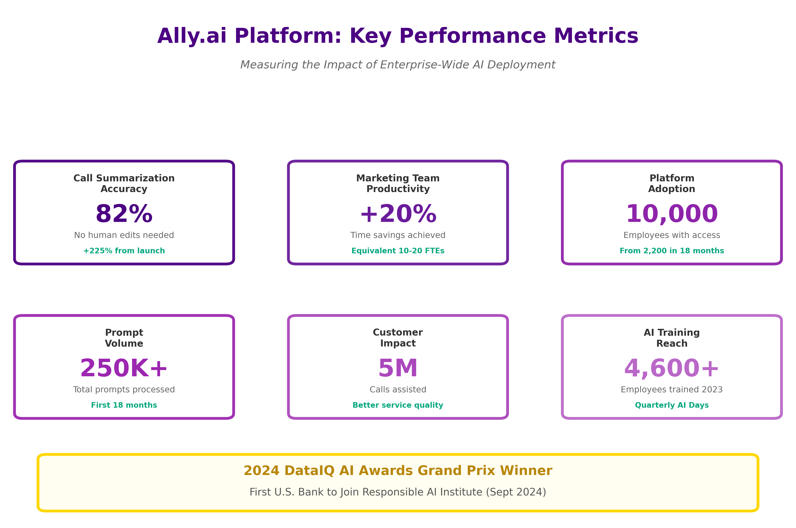

# Financial-s-AI-Transformation-A-Strategic-Analysis

**What Makes This Analysis Unique:**

This artifact examines Ally Financial's comprehensive artificial intelligence strategy, with a focus on its proprietary platform, Ally.ai, and its leadership in responsible AI adoption within the banking sector. As the nation's largest all-digital bank with $196 billion in assets, Ally has positioned itself at the forefront of AI innovation while maintaining stringent governance and ethical standards required in highly regulated financial services.

**Key Findings:**
- Ally.ai platform deployed to 10,000+ employees enterprise-wide (July 2024)
- 250,000+ prompts processed with 20% productivity increase in marketing teams
- 82% accuracy rate in AI-generated call summaries, eliminating human modifications
- First U.S. bank to join the Responsible AI Institute (September 2024)
- Won 2024 DataIQ AI Awards Grand Prix for AI innovation

**Why This Matters:**

This analysis demonstrates how a mid-sized digital bank successfully navigated the challenges of rapid AI adoption while prioritizing security, governance, and customer trust—offering valuable lessons for the broader financial services industry and providing a roadmap for responsible AI implementation that I aim to bring to my future role in data science.

## Introduction: The Digital Banking Imperative
### 1.1 Industry Context

The financial services industry faces mounting pressure to modernize operations through the use of artificial intelligence. According to recent industry surveys, 96% of executives identify generative AI as a critical boardroom topic, and 47% of technology leaders name AI as their top budget priority. However, adoption remains in its early stages, particularly in highly regulated sectors such as banking, where risks must be carefully managed.

### 1.2 Research Objectives

This artifact analyzes:
1. Ally's proprietary AI platform architecture and capabilities
2. Governance frameworks enabling responsible AI deployment
3. Measurable business outcomes and ROI across use cases
4. Strategic positioning for future AI developments, including autonomous agents
5. Lessons learned applicable to other financial institutions

### 1.3 Ally Financial Profile

**Company Overview:**

- **Founded:**1919 (as GMAC); rebranded as Ally Financial in 2009
- **Headquarters:**Detroit, Michigan
- **Business Model:**All-digital bank (no physical branches)
- **Core Services:**Auto financing, digital banking, corporate finance, securities brokerage

**Digital-First Philosophy:**

Ally's competitive advantage stems from its purely digital infrastructure. Unlike traditional banks burdened by legacy branch networks, Ally operates entirely through cloud-based technologies, creating a nimble foundation for AI adoption.

## The Ally.ai Platform: Architecture and Capabilities
### Technical Architecture
**Core Design Principles:**
- **LLM-Agnostic Infrastructure:** Platform built to support multiple large language models
- **Cloud-Native:** Leverages AWS and Microsoft Azure for scalability
- **Security-First:** Built-in controls meeting financial services regulatory requirements
- **Vendor Flexibility:** Ability to integrate new models without platform redesign
- **Current LLM Integrations:**
- Microsoft Azure OpenAI Service (GPT-3.5 Turbo, GPT-4)
- Amazon Bedrock (under evaluation, 3-4 month approval process)
- Future capability for Claude, Llama, and emerging models
**Multi-Model Query Approach**

Users can:
- Query individual models of their choice
- Submit queries across multiple models simultaneously
- Receive consolidated, summarized results
- Compare responses across models to determine optimal output

### Platform Capabilities
**Traditional ML/MLOps:**
- Risk modeling and credit decisioning
- Fraud detection algorithms
- Customer segmentation
- Predictive analytics

**Generative AI Applications:**
- Real-time call summarization
- Email drafting and content generation
- Meeting agenda creation
- Document proofreading and editing
- Creative brainstorming and ideation
- Data analysis and insights generation
- SEO keyword optimization
- Marketing copy generation

## Governance Framework: The ATOM Model
### Ally Technology Operating Model (ATOM)
Ally adapted its existing technology governance framework specifically for AI deployment, creating a structured five-pillar approach that guides every AI initiative from conception through continuous improvement. This disciplined framework ensures that AI applications align with business objectives while maintaining the security and compliance standards essential to banking operations.

### AI Working Group Structure
Ally's AI Working Group represents a deliberate departure from siloed decision-making, bringing together diverse expertise to ensure comprehensive oversight of AI initiatives. The group's composition reflects the multifaceted nature of AI governance in financial services, where technical capabilities must be aligned with regulatory requirements, risk management, audit standards, and business objectives.

### AI Playbook: Empowering Responsible Innovation
The Ally AI Playbook transforms abstract governance principles into practical guidance that employees can apply daily, democratizing AI innovation while maintaining necessary controls. Unlike traditional IT governance that centralizes decision-making, the playbook empowers employees across the organization to explore AI applications within clearly defined guardrails. This approach recognizes that the best ideas for AI applications often come from employees closest to business problems, not exclusively from technology teams or executive leadership.

At its core, the playbook provides comprehensive process documentation that walks employees through the concept-to-completion journey for AI initiatives. Employees can access clear workflows that explain how to propose an AI use case, which tools are available and how to access them, the security and privacy requirements that must be satisfied, and whom to contact when they encounter obstacles. This documentation reduces friction for innovation—employees don't need to navigate bureaucratic ambiguity or guess at proper procedures. The playbook makes explicit what might otherwise require institutional knowledge, accelerating the path from idea to implementation while ensuring compliance.

The playbook also includes structured use-case templates that guide employees in critical thinking about their AI proposals. Business value assessment frameworks help teams articulate not just what they want to build but why it matters and how success will be measured. Risk evaluation checklists prompt consideration of potential downsides, such as data privacy implications, accuracy requirements, and bias risks, before resources are invested. Pilot program design guidelines offer proven approaches for testing AI applications on a limited scope before enterprise-wide rollout, while production deployment criteria establish clear standards that must be met before moving from pilot to production.

## Business Impact: Measurable Outcomes
### Call Summarization Use Case

**Implementation:** June-July 2023 pilot with 700+ customer service associates
**Challenge Addressed:** Customer service representatives spent significant time manually documenting call details, reducing time available for meaningful customer interactions.
**Solution:** Ally.ai integrated into the technology stack to provide real-time transcription and summarization of customer calls using a private LLM.
**Results:**
- **Initial Accuracy:** 20-25% of summaries required no modifications
- **30-Day Performance:** 75% accuracy (summaries requiring no changes)
- **60-Day Performance:** 82% accuracy
- **Business Impact:** Associates freed to focus on customer relationship building
- **Scale:** Approximately 5 million customer calls assisted over 18 months

### Enterprise-Wide Adoption Metrics

**Platform Usage (First 18 Months):**
- 250,000+ prompts submitted
- 2,200 employees trained initially
- 10,000 employees with access post-enterprise rollout
- Departments: Marketing, Audit, Risk, Technology, Customer Service

**Training Engagement:**
- 4,600+ employees trained in 2023
- 2,000+ attendees at Q1 2024 AI Day
- Quarterly AI Days featuring internal and external experts
- Bi-weekly AI Community of Practice sessions
- Regular office hours for personalized guidance

## Future Strategic Direction
### Autonomous AI Agents

**Vision:** Ally plans to experiment with Amazon Bedrock's autonomous-agent capabilities, representing a transition from Large Language Models (LLMs) to Large Action Models (LAMs).
**Key Distinction:**
- **LLMs:** Collect, synthesize, and summarize information
- **LAMs:** Take action on information, performing tasks autonomously

**Potential Applications:**
**Product Owner Assistant**

An AI agent serving as a virtual product owner on Agile development teams, capable of:
- Sprint planning and backlog prioritization
- User story creation and refinement
- Stakeholder communication
- Progress tracking and reporting

**Customer Service Automation**

Agents that can:
- Resolve routine inquiries without human intervention
- Execute transactions (payments, transfers, account updates)
- Escalate complex issues to human specialists
- Learn from interactions to improve responses

**Risk Management**

Autonomous monitoring of:
- Portfolio exposure in real-time
- Regulatory compliance violations
- Fraud pattern detection
- Market risk indicators

## Conclusion and Recommendations
### Key Takeaways
**Ally Financial's AI transformation demonstrates:**

1. **Proprietary platforms enable strategic flexibility:** Building Ally.ai in-house provided control over security, governance, and multi-vendor integration that commercial platforms cannot match.
2. **Governance and innovation are complementary, not contradictory:** Structured frameworks like ATOM actually accelerate deployment by providing clear pathways for approval.
3. **Employee enablement is critical to ROI:** The 250,000 prompts and 20% productivity gains stem from comprehensive training and cultural support.
4. **Responsible AI is both an ethical imperative and a business strategy:** Membership in the Responsible AI Institute and public commitments create differentiation and trust.
5. **Patience with emerging technology pays off:** The journey from 25% to 82% accuracy in call summarization required tolerance for imperfect initial results.

## References

1. TechTarget. (2024). "Ally's generative AI strategy eyes multiple LLMs, AI agents." CIO News.
2. Ally Financial. (2024). "Ally Financial rolls out proprietary AI platform enterprise-wide." Press Release, July 23.
3. DataIQ. (2024). "AI Awards 2024 – Grand Prix: Ally Financial." Award Recognition.
4. The Financial Brand. (2024). "An Inside Look at Ally Bank's Measured Roll-Out of GenAI."
5. Yahoo Finance. (2024). "Ally Financial Inc. (ALLY): This Fintech Stock Is Riding the AI Wave Higher." October 18.
6. CIO.com. (2024). "Ally Financial finds gen AI success with three guiding principles." CIO 100 Awards.
7. Ally Tech Blog. (2024). "Doing it right with AI: Ally's foray into generative AI."
8. Ally Tech Blog. (2024). "Unveiling the Ally Innovation Challenge – Responsible AI." May 7.
9. Responsible AI Institute. (2024). "Responsible AI Institute Welcomes Ally Financial as Newest Member." September 18.
10. FinXTech. (2024). "Ally Financial Explores Responsible AI." June 13.

