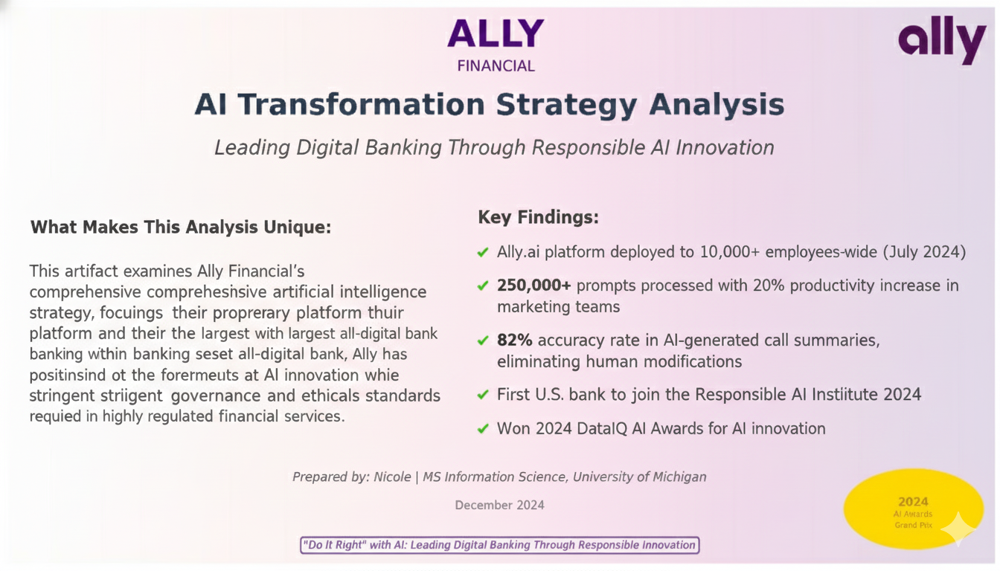

# Financial-s-AI-Transformation-A-Strategic-Analysis

**What Makes This Analysis Unique:**
This artifact examines Ally Financial's comprehensive artificial intelligence strategy, with a focus on its proprietary platform, Ally.ai, and its leadership in responsible AI adoption within the banking sector. As the nation's largest all-digital bank with $196 billion in assets, Ally has positioned itself at the forefront of AI innovation while maintaining stringent governance and ethical standards required in highly regulated financial services.

**Key Findings:**
- Ally.ai platform deployed to 10,000+ employees enterprise-wide (July 2024)
- 250,000+ prompts processed with 20% productivity increase in marketing teams
- 82% accuracy rate in AI-generated call summaries, eliminating human modifications
- First U.S. bank to join the Responsible AI Institute (September 2024)
- Won 2024 DataIQ AI Awards Grand Prix for AI innovation

**Why This Matters:**
This analysis demonstrates how a mid-sized digital bank successfully navigated the challenges of rapid AI adoption while prioritizing security, governance, and customer trust—offering valuable lessons for the broader financial services industry and providing a roadmap for responsible AI implementation that I aim to bring to my future role in data science.
---

## Introduction: The Digital Banking Imperative
### 1.1 Industry Context

The financial services industry faces mounting pressure to modernize operations through the use of artificial intelligence. According to recent industry surveys, 96% of executives identify generative AI as a critical boardroom topic, and 47% of technology leaders name AI as their top budget priority. However, adoption remains in its early stages, particularly in highly regulated sectors such as banking, where risks must be carefully managed.

### 1.2 Research Objectives

This artifact analyzes:
1. Ally's proprietary AI platform architecture and capabilities
2. Governance frameworks enabling responsible AI deployment
3. Measurable business outcomes and ROI across use cases
4. Strategic positioning for future AI developments, including autonomous agents
5. Lessons learned applicable to other financial institutions

###1.3 Ally Financial Profile

**Company Overview:**

- **Founded:**1919 (as GMAC); rebranded as Ally Financial in 2009
- **Headquarters:**Detroit, Michigan
- **Business Model:**All-digital bank (no physical branches)
- **Core Services:**Auto financing, digital banking, corporate finance, securities brokerage

**Digital-First Philosophy:**

Ally's competitive advantage stems from its purely digital infrastructure. Unlike traditional banks burdened by legacy branch networks, Ally operates entirely through cloud-based technologies, creating a nimble foundation for AI adoption.

## The Ally.ai Platform: Architecture and Capabilities
### Technical Architecture
**Core Design Principles:**
- **LLM-Agnostic Infrastructure:**Platform built to support multiple large language models
- **Cloud-Native:**Leverages AWS and Microsoft Azure for scalability
- **Security-First:**Built-in controls meeting financial services regulatory requirements
- **Vendor Flexibility:**Ability to integrate new models without platform redesign
- **Current LLM Integrations:**
- Microsoft Azure OpenAI Service (GPT-3.5 Turbo, GPT-4)
- Amazon Bedrock (under evaluation, 3-4 month approval process)
- Future capability for Claude, Llama, and emerging models
**Multi-Model Query Approach**

Users can:
- Query individual models of their choice
- Submit queries across multiple models simultaneously
- Receive consolidated, summarized results
- Compare responses across models to determine optimal output

### Platform Capabilities
**Traditional ML/MLOps:**
- Risk modeling and credit decisioning
- Fraud detection algorithms
- Customer segmentation
- Predictive analytics

**Generative AI Applications:**
- Real-time call summarization
- Email drafting and content generation
- Meeting agenda creation
- Document proofreading and editing
- Creative brainstorming and ideation
- Data analysis and insights generation
- SEO keyword optimization
- Marketing copy generation

